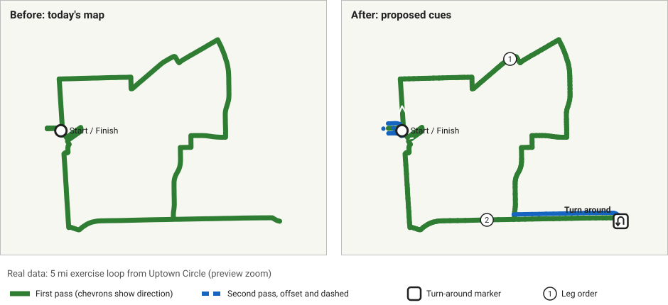
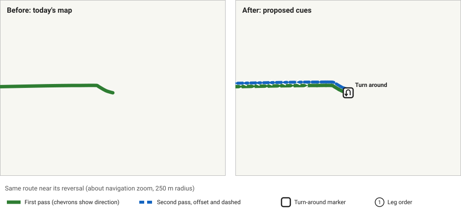

# Spike: exercise-route turnarounds and retraced legs (earlier issue 26) — September 27, 2026

**Question:** why can't a rider tell, from the route map, where an exercise route reverses, which parts are ridden in both directions, or in what order overlapping parts are followed? Is the cause route generation, lost traversal information, or rendering?

**Answer:** route generation keeps the order and the reversals, but the information is lost at three merge steps, and the renderers have no cue to draw with even when it's available. Guidance has the same gap: no turn-around instruction is produced.

## Fixtures and traces

Everything here is non-sensitive: synthetic geometry, plus real routes from public start points (Uptown Circle and the real-data suite's central point). The screenshot mentioned in earlier issue 26 was not used.

- `shared/src/commonTest/.../ExerciseRouteReversalFixtureTest.kt` has four synthetic routes: an out-and-back, a lollipop, a figure-8 crossing, and a near-parallel return on a different path. It checks what already works, and holds two `@Ignore`d targets for earlier issue 35 and earlier issue 36. Both targets fail today; that was checked by enabling them.
- [`fixture-trace.json`](fixture-trace.json) holds the ordered segments, drawable polylines, reversal points and instructions for those fixtures.
- [`real-trace.json`](real-trace.json) holds the same for a 5 mi loop from Uptown Circle and a 3 mi loop from the central point. It includes the 237 per-edge segments behind the 5 mi loop's 22 route segments and 16 drawable polylines. It was produced by a temporary real-data diagnostic on the September 27 assets.

## Findings

### 1. Route generation is sound

At edge level the route keeps its traversal order, and every reversal is detectable: two consecutive traversals of the same edge. `ExerciseRouteTurnaroundSijko` counts the out-and-back fixture's reversal and correctly counts none for the lollipop, the figure-8 crossing, or the near-parallel return. On real data, 4 of 6 loops (Uptown Circle and central starts, 3/5/10 mi) contain a reversal. These are legitimate: a short spur ridden out and back.

### 2. Traversal information is lost at three merge steps

| Step | Code | Effect |
|---|---|---|
| Route construction | `TrailRouteSegmentMergeSijko.merge` in `ExerciseRouteCalculationSijko` / `TrailRouteFinderSijko` | Consecutive same-style segments join whenever one ends where the next starts. A U-turn always does, so a spur becomes one segment A→B→A. |
| Map and saved-route JSON | `TrailRouteMapJsonSijko` | Carries `segments` and `traversalEdges`; `edges` decodes as empty. The reversal is only implicit, in repeated traversal keys. |
| Drawing | `TrailRouteDrawableSegmentMergeSijko` | Merges again before polylines are drawn. |

Real 5 mi loop: 237 edge segments → 22 route segments → 16 drawable polylines. Its one reversal exists only at edge level.

### 3. Guidance misses reversals and same-trail junction turns

`TrailRouteInstructionLegSijko` builds legs from merged segments, and `TrailRouteTurnInstructionSijko` computes a maneuver only when the trail name or segment type changes.

- The out-and-back fixture gets only `Start` and `Arrive`.
- The lollipop also gets no turn at its loop junction.
- On real data, **0 of 4** reversals have an instruction within 25 m, and each loop has 1–6 turns sharper than 120° inside merged polylines. That count is an upper-bound proxy, since some are geometry wiggles.

### 4. Rendering has no cue for reversal, direction or a second pass

`TrailRouteMapActivity` draws legend-colored polylines and a Start/Finish marker. `AndroidTrailRouteShareImageComposer` does the same for shared images. There's no turnaround marker, no direction cue, and nothing to show trail ridden twice. The shared route text doesn't mention reversals either. iOS has no route map yet, since the app is a shared Compose shell, so iOS parity isn't a separate issue now.

## Recommended design

1. **Shared metadata (earlier issue 36):** reversal points with distance along the route, a pass number per drawable piece, and leg order between reversals. Compute it from edges when routes are built, carry it through map and saved-route JSON, and derive it from `traversalEdges` for older saved routes. Don't merge drawable segments across a reversal.
2. **Guidance (earlier issue 35):** a "Turn around" instruction at each reversal, plus junction-turn instructions from graph-edge boundaries rather than merged polylines. It must never fire at a crossing.
3. **Android map (earlier issue 37):** a turnaround marker with a text label; direction chevrons; a second pass drawn slightly offset with a dashed pattern; leg badges in preview if they stay readable; progress highlighting during navigation. Every cue uses shape, pattern or label, not color alone.
4. **Shared images and text (earlier issue 38):** the same marker and second-pass treatment, and a turnaround mention in the text.

Tradeoffs:
- **Chevrons and leg badges** add clutter on long loops. The mockups keep badges for leg order only, not for every segment.
- **Offsetting the second pass** misplaces the line by a few meters at high zoom. A dashed overlay without offset is the fallback.
- **Pass metadata** changes the saved-route format, so older routes need the derivation path.

## Mockups

These are generated by [`render_mockups.py`](render_mockups.py) from the traces. "Before" mirrors today's drawing; "After" shows the proposed cues.

- Out-and-back fixture: [`fixture-out-and-back.svg`](fixture-out-and-back.svg)
- Lollipop fixture: [`fixture-lollipop.svg`](fixture-lollipop.svg)
- Real 5 mi loop from Uptown Circle, preview zoom: [`real-uptown-5mi-preview.svg`](real-uptown-5mi-preview.svg)
- Same loop at about navigation zoom around its reversal: [`real-uptown-5mi-navigation.svg`](real-uptown-5mi-navigation.svg)

## Follow-up issues

- earlier issue 35: turn-around instruction at reversals and same-trail junction turns.
- earlier issue 36: keep reversal and pass order in route data given to renderers.
- earlier issue 37: show turnarounds, direction and second passes on the Android route map. Depends on earlier issue 36.
- earlier issue 38: show turnarounds in shared route images and text. Depends on earlier issue 36.
